# 🛡️ ReconXplorer

> **Automated Reconnaissance and Vulnerability Scanner**

ReconXplorer is a powerful, web-based vulnerability scanning platform that automates reconnaissance and vulnerability detection. It seamlessly integrates industry-standard tools such as Nmap, WhatWeb, DNSRecon, and Dirb into a unified, user-friendly interface. Designed with both security researchers and system administrators in mind, it provides an organized way to assess network perimeters.

---

## ✨ Features

- **Automated reconnaissance scanning:** Streamline your intelligence gathering process.
- **Nmap port scanning:** Discover open ports and running services.
- **DNS enumeration:** Map out target infrastructure.
- **Web technology detection:** Identify CMS, frameworks, and web servers.
- **Directory brute forcing:** Uncover hidden endpoints and resources.
- **Real-time scan output:** Live execution updates powered by Flask-SocketIO.
- **Scan history logging:** Keep track of all your past scans and findings.
- **PDF report generation:** Export professional security reports with a single click.

---

## 📸 Screenshots

### Authentication & Landing
<div align="center">
&nbsp; 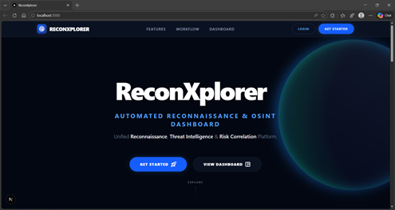
</div>
<div align="center">
&nbsp; 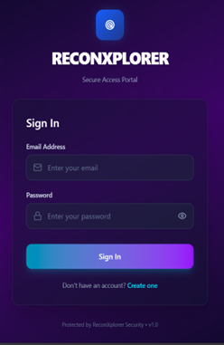
&nbsp; 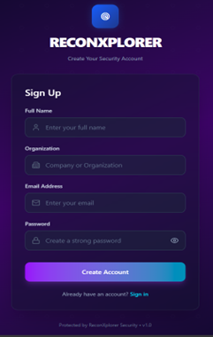
</div>

### Dashboards
<div align="center">
&nbsp; 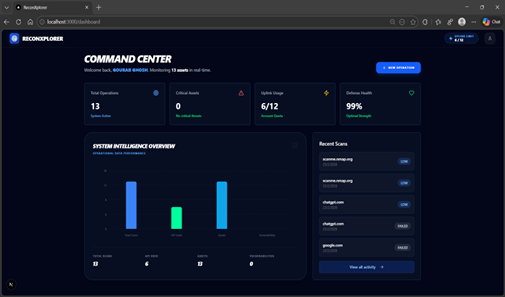
&nbsp; 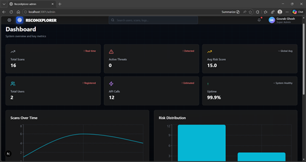
</div>
<div align="center">
&nbsp; 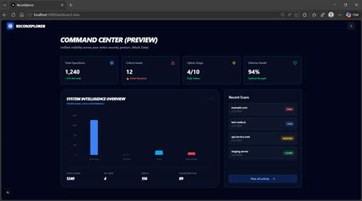
</div>

### Navigation Menus
<div align="center">
&nbsp; 
&nbsp; 
</div>

### Scanning Interface & Core Results
<div align="center">
&nbsp; 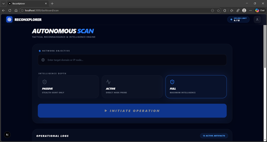
&nbsp; 
</div>
<div align="center">
&nbsp; 
</div>

### In-Depth Full Scan Details
<div align="center">
&nbsp; 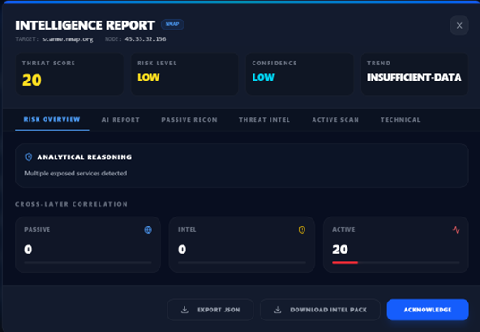
&nbsp; 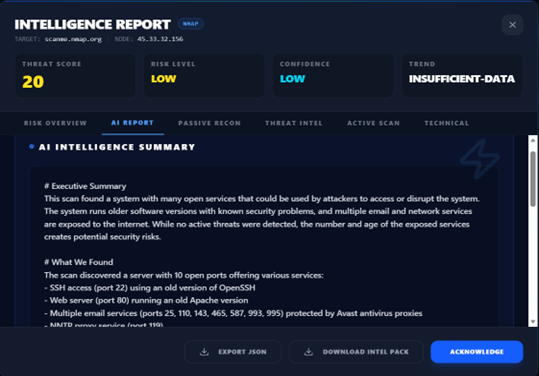
</div>
<div align="center">
&nbsp; 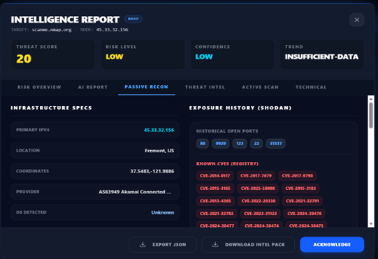
&nbsp; 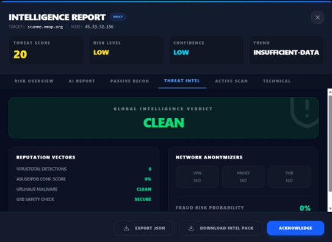
</div>
<div align="center">
&nbsp; 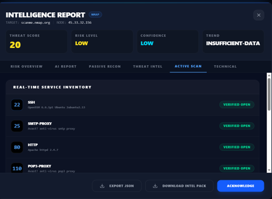
&nbsp; 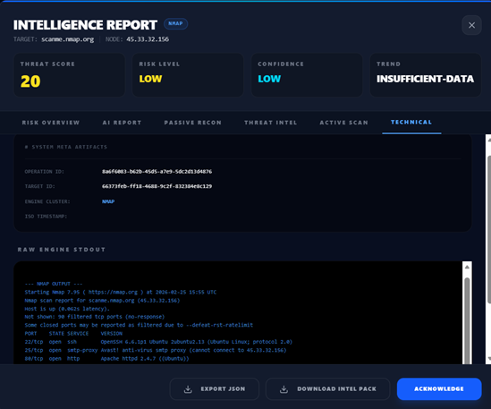
</div>

### Reporting
<div align="center">
&nbsp; 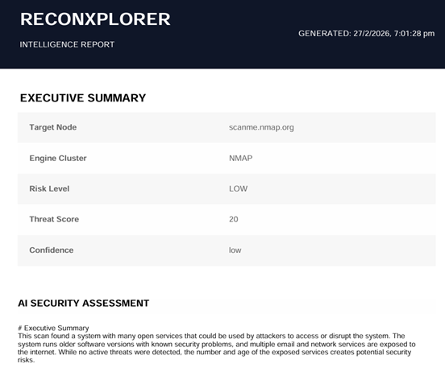
</div>

---

## ⚙️ Prerequisites

Before you begin, ensure you have the following installed on your machine:
- **Python 3.8+**
- **Node.js** (v14 or higher)
- **Docker** and **Docker Compose** (optional, but recommended)
- **Security Tools:** Nmap, WhatWeb, DNSRecon, Dirb (If running locally instead of Docker)

---

## 🚀 Installation

You can run ReconXplorer fully locally or using Docker. Here is the step-by-step guide.

### 1. Clone the Repository
```bash
git clone https://github.com/gourab-0/ReconXplorer
cd ReconXplorer
```

### 2. Backend Setup
The backend runs on Flask and handles the integrations with security tools.

```bash
# Navigate to backend
cd backend

# Create and activate a virtual environment (optional but recommended)
python -m venv venv
source venv/bin/activate  # On Windows use `venv\Scripts\activate`

# Install Python dependencies
pip install -r requirements.txt

# (Optional) Run database migrations if using Alembic
alembic upgrade head

# Start the application
python app.py
```

### 3. Frontend Setup
ReconXplorer has two core frontend modules: Dashboard and Admin.

**Dashboard Setup:**
```bash
# Open a new terminal and navigate to Dashboard
cd frontend/dashboard

# Install React dependencies
npm install

# Start the frontend app
npm start  # Or `npm run dev` depending on the bundler
```

**Admin Panel Setup:**
```bash
# Open a new terminal and navigate to Admin
cd frontend/admin

# Install React dependencies
npm install

# Start the admin app
npm start  # Or `npm run dev`
```

### 4. Docker Installation (Recommended)
If you want to skip manual configuration, you can deploy the full stack instantly via Docker.

```bash
# Navigate to docker directory
cd docker

# Build and start all containers
docker-compose up --build -d
```
All tools, databases, and servers will automatically be configured and linked.

---

## 🛠️ Tech Stack

- **Backend:** Flask
- **Frontend:** React
- **Database:** SQLite / PostgreSQL
- **Security Tools Integration:** Nmap, WhatWeb, DNSRecon, Dirb
- **Deployment:** Docker, Docker Compose

---

## 🏗️ Architecture

The high-level architecture separates user interactions, backend logic, external tool execution, and data persistence securely in different layers.

**User → Flask API → Scan Engine → Security Tools → Database → Report**

<div align="center">
&nbsp; 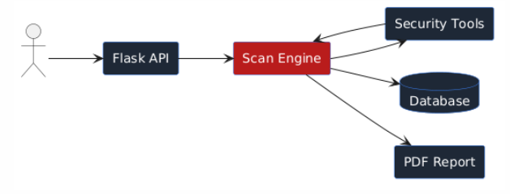
</div>

*(Requests flow from the User, are processed by the Flask API and Scan Engine, handed off to the Security Tools, and results are written to the Database or compiled into a PDF Report.)*

---

## 💻 Usage
1. Open your browser and navigate to `http://localhost:3000` for the dashboard.
2. Sign in or create an account if required.
3. Enter your target IP/Domain in the "New Scan" interface.
4. Select your recon modules (Nmap, DNSRecon, etc.) and launch the scan.
5. Monitor real-time logs parsing using websockets.
6. Once complete, export results via PDF or view them historically.

---

## ⚠️ Disclaimer

**This project is created for educational and authorized security testing only.**
Do not scan systems, networks, or applications for which you do not have explicit, written permission. The developers assume no liability and are not responsible for any misuse or damage caused by this program.
